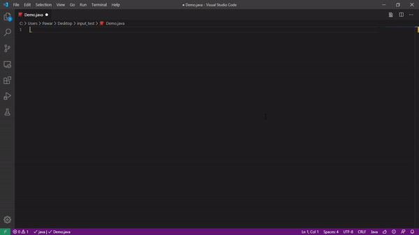

# Java CP Snippets 

It create starter template for java which is useful for any competitive programming contests such as Codeforces, Codeshef.

## Features

- Adds Reader class. 
- Adds main method with Reader and PrintWriter instance.

## Usage 

- save file as .java and <kbd>ctrl</kbd>+<kbd>A</kbd> then <kbd>delete</kbd>
- Type go to ready set go. 

## Release Notes

### 1.0.0

Initial release of java cp snippets extension

### 1.0.1 
Initial Bug Fix 

### 1.0.5 
Readme Updated 

 **Enjoy!** 
